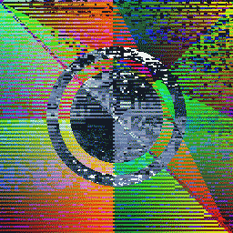

# Everyday One Motion - 20160519 "Glitchcircle"  

  

Processing, GLSL, GPU Glitch  

[Everyday One Motion](http://motions.work/motion/225)  

## Glitchcircle

がむしゃらに変数の値を出し入れすることで、未初期化の変数を狂わせていく。狙って狂わせることは困難で、手探りで良い図を模索していく。  
どこまで乱れに作為的に干渉して良いものか。プログラムを書いている自分自身にとって意外性は高いが、視聴者からするとこの表現は面白いか？  
